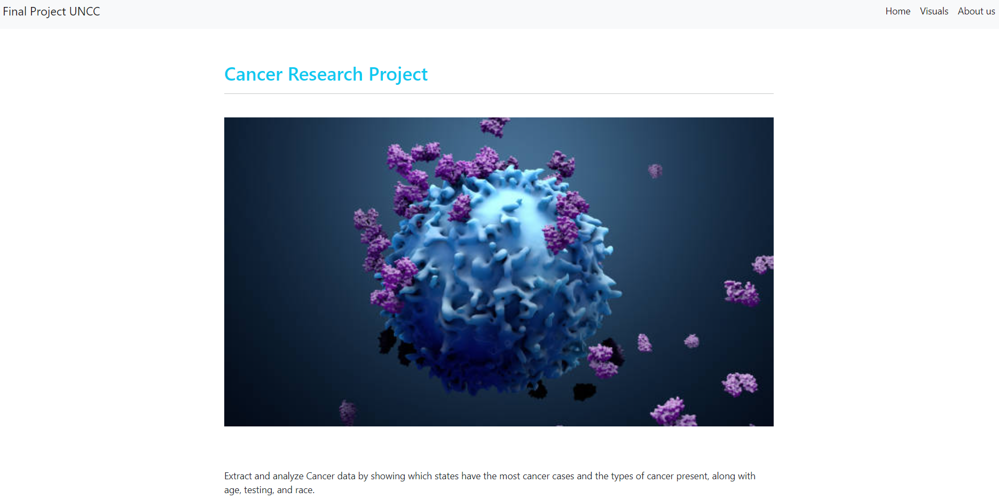

# Cancer Research

## Background

We’re a team who came together to come up with a statistical analysis on Cancer and the data we have collected pin points age, race, sex, location, death rates, diagnosis, and survival rates. 

   - Here is a snapshot of the app: 

- ### The app's link for this project is [here](http://cancer-data.herokuapp.com/).
 

## Data

Data was obtained through the website Kaggle containing different data sets on csv files. 

## Database Creation

The team utilized Python/Pandas to pull in the 2 data sources.  Cleansing was performed to merge the data into 1 dataframe where it was broken down to each group member creating a Flask API, HTML/CSS and Javascript. 

## Flask API
Utilizing Flask, we were able to connect to the databases to assist in visual creation.  The Flask API connection also served as the landing page from which the visualizations and data analysis can be viewed and interacted with by the user.   

A seperate app.py file was created to facilitate the flask build-out.  This included importing dependencies to connect to our SQL databases and then loop through the databases ultimately creating dictionaries from which the data could be pulled by other team members to leverage in visualization creation.  

## HTML/CSS & Javascript
The initial HTML/CSS code was built as a shell with placehoders linked to Javascript files for team members to build out thier visualizations and apply 
consistant formatting and sizing using Bootstrap.

## Visualizations
The visualizations the team generated told the story of where we focused on the actual Cancer data it will show different information based on what your looking for. The focus of this project was on the age, race, sex, location, death rates, diagnosis and survival rates of Cancer. 
 https://public.tableau.com/app/profile/akanksha4588/viz/CancerResearch-DataAnalyst-Project/CancerResearchStats

## Team Members
* 1 Luis Rojas
* 2 Zack Rogers
* 3 Hector Ladero
* 4 Akanksha Kukhranyia
* 5 Mariam Ahmad 
